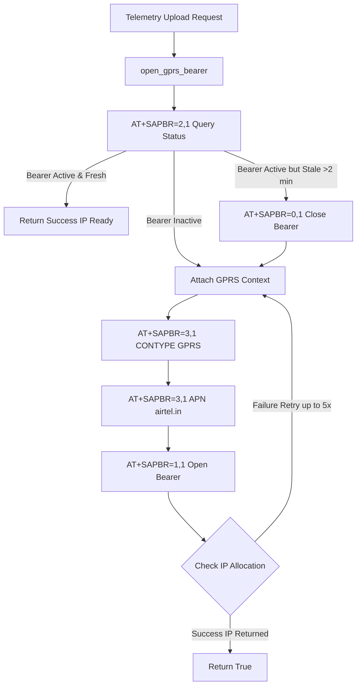

# GPRS 2G Data Bearer: Application Usage, Working & Implementation Procedure

This document details the practical application usage, step-by-step operational flow, C++ source code implementation procedure, and testing verification for GPRS packet data context attachment, APN setup, and cellular NAT timeout management on the ESP32-S3 Mini-1 and SIM868 platform.

---

## 1. Application Usage & Real-World Use Cases

The GPRS subsystem provides mobile IP connectivity over 2G cellular networks:

1. **IP Network Access for HTTP Telemetry**:
   * **Usage**: Enables packet data transport for JSON telemetry uploads without requiring local Wi-Fi connectivity.
2. **Dynamic GPRS Bearer Recovery**:
   * **Usage**: Automatically recovers from transient cellular tower disconnects, base-station handovers, and Airtel cell tower NAT expirations while in mobile transit.

---

## 2. Step-by-Step Working Mechanism



---

## 3. Firmware Implementation Procedure

### 3.1 Key C++ Source Implementation Code in `main/gl868_modem.cpp`

#### Step 1: APN Configuration & GPRS Registration Check
```cpp
static bool configure_apn_if_needed(void) {
  std::string response;
  
  /* 1. Check network registration (CREG/CGREG) */
  send_at_command("AT+CREG?\r", &response, 5000);
  send_at_command("AT+CGREG?\r", &response, 5000);

  /* 2. Configure GPRS Profile CID 1 */
  send_at_command("AT+SAPBR=3,1,\"CONTYPE\",\"GPRS\"\r", &response, 5000);
  std::string apn_cmd = "AT+SAPBR=3,1,\"APN\",\"" + get_configured_apn() + "\"\r";
  return send_at_command(apn_cmd, &response, 5000);
}
```

#### Step 2: GPRS Bearer Lifecycle & Proactive Refresh (`open_gprs_bearer`)
```cpp
static bool open_gprs_bearer(void) {
  std::string response;

  /* 1. Network delay for Airtel IP routing stabilization */
  vTaskDelay(pdMS_TO_TICKS(2000));

  /* 2. Check if bearer is already active */
  if (send_at_command("AT+SAPBR=2,1\r", &response, 5000, "+SAPBR:") &&
      response.find("+SAPBR: 1,1") != std::string::npos) {
    ESP_LOGI(TAG, "GPRS bearer already ready (APN=%s): %s",
             get_configured_apn().c_str(), flatten_response(response).c_str());
    return true;
  }

  /* 3. Execute up to 5 attempts to activate PDP context */
  configure_apn_if_needed();
  for (int attempt = 1; attempt <= 5; attempt++) {
    ESP_LOGI(TAG, "Attaching GPRS data context (attempt %d/5)...", attempt);
    send_at_command("AT+SAPBR=1,1\r", &response, 10000);
    
    /* Verify IP allocation */
    if (send_at_command("AT+SAPBR=2,1\r", &response, 5000, "+SAPBR:") &&
        response.find("+SAPBR: 1,1") != std::string::npos) {
      ESP_LOGI(TAG, "GPRS bearer ready (APN=%s): %s",
               get_configured_apn().c_str(), flatten_response(response).c_str());
      return true;
    }
    vTaskDelay(pdMS_TO_TICKS(3000));
  }

  ESP_LOGE(TAG, "[CRITICAL] Failed to attach GPRS. Check SIM data plan & APN setting!");
  return false;
}
```

---

## 4. Implementation Testing & Verification

### 4.1 Configuration setup in `sdkconfig`
```text
CONFIG_SAFETY_BAND_GPRS_APN="airtel.in"
CONFIG_SAFETY_BAND_HTTP_UPLOAD=y
```

### 4.2 Expected Log Output
```text
I (31069) sim868_bridge: APN already configured: airtel.in
I (31069) sim868_bridge: Attaching GPRS data context (attempt 1/5)...
I (36669) sim868_bridge: GPRS bearer ready (APN=airtel.in): +SAPBR: 1,1,"10.145.148.167" OK
```
