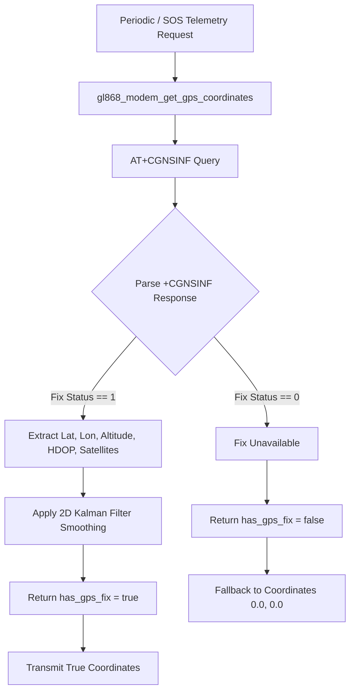

# GPS, GLONASS & BeiDou GNSS: Application Usage, Working & Implementation Procedure

This document details the practical application usage, step-by-step operational flow, C++ source code implementation procedure, and testing verification for multi-constellation (GPS, GLONASS, BeiDou) GNSS positioning on the ESP32-S3 Mini-1 and SIM868 platform.

---

## 1. Application Usage & Real-World Use Cases

Multi-constellation GNSS positioning provides satellite location tracking across three major satellite systems:

1. **High-Accuracy Live Geofencing**:
   * **Usage**: Provides sub-10 meter positioning accuracy for vulnerable individuals, school children, and outdoor workers under open sky and urban conditions.
2. **Emergency SOS Rescue Location**:
   * **Usage**: Supplies exact latitude/longitude coordinates embedded in emergency SMS alerts and live HTTP telemetry streams when an incident occurs.

---

## 2. Step-by-Step Working Mechanism



---

## 3. Firmware Implementation Procedure

### 3.1 Key C++ Source Implementation Code in `main/gl868_modem.cpp`

#### Step 1: GNSS Power Initialization (`gl868_modem_init`)
```cpp
static bool init_gnss(void) {
  std::string response;
  
  /* 1. Turn on GNSS power */
  if (!send_at_command("AT+CGNSPWR=1\r", &response, 5000)) return false;
  
  /* 2. Configure NMEA output sentences */
  send_at_command("AT+CGNSSEQ=\"RMC\"\r", &response, 5000);
  ESP_LOGI(TAG, "GPS power on: SUCCESS");
  return true;
}
```

#### Step 2: NMEA Sentence Parsing (`parse_gps_coordinates_from_cgnsinf`)
```cpp
static bool parse_gps_coordinates_from_cgnsinf(const std::string &response,
                                               double *latitude,
                                               double *longitude) {
  /* Response format: +CGNSINF: <run_status>,<fix_status>,<utc>,<lat>,<lon>,<alt>,... */
  size_t tag_pos = response.find("+CGNSINF:");
  if (tag_pos == std::string::npos) return false;

  std::vector<std::string> tokens = split_string(response.substr(tag_pos + 9), ',');
  if (tokens.size() < 5) return false;

  int fix_status = std::atoi(tokens[1].c_str());
  if (fix_status != 1) return false; // No valid satellite lock

  *latitude = std::atof(tokens[3].c_str());
  *longitude = std::atof(tokens[4].c_str());
  return true;
}
```

#### Step 3: If/Else Fallback Strategy (`gl868_modem_upload_telemetry`)
```cpp
extern "C" bool gl868_modem_upload_telemetry(const char *event_type) {
  if (!s_state.initialized) return false;

  double latitude = 0.0;
  double longitude = 0.0;
  bool has_gps_fix = gl868_modem_get_gps_coordinates(&latitude, &longitude);

  if (has_gps_fix) {
    ESP_LOGI(TAG, "GNSS fix valid: uploading HTTP telemetry with coordinates (%.6f, %.6f)",
             latitude, longitude);
  } else {
    ESP_LOGW(TAG, "GNSS fix pending/unavailable; sending HTTP telemetry with fallback coordinates (0.0, 0.0)");
    latitude = 0.0;
    longitude = 0.0;
  }

  GpsFixInfo fix;
  fix.valid = has_gps_fix;
  fix.latitude = latitude;
  fix.longitude = longitude;
  return post_telemetry_packet(event_type, fix, gl868_modem_get_battery_percent());
}
```

---

## 4. Implementation Testing & Verification

### 4.1 Field Testing Procedure
1. Attach active GNSS patch antenna to SIM868 IPEX connector.
2. Place hardware near a window or outdoors under open sky.
3. Flash firmware and monitor logs: `idf.py flash monitor`.

### 4.2 Expected Log Output (GNSS Satellite Lock Acquired)
```text
I (30859) sim868_bridge: GPS power on: SUCCESS
I (30869) sim868_bridge: GPS sequence configured for richer metadata
I (150949) sim868_bridge: GNSS fix valid: uploading HTTP telemetry with coordinates (17.385044, 78.486671)
I (150979) sim868_bridge: Posting normalized smart-band event to http://my-esp32-test.free.beeceptor.com...
```
