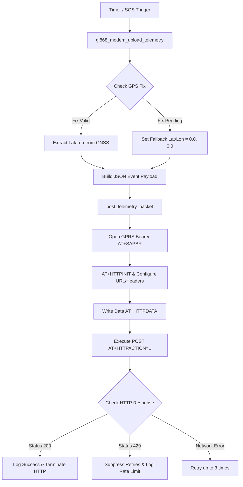

# HTTP JSON Telemetry Packet: Application Usage, Working & Implementation Procedure

This document details the practical application usage, step-by-step operational flow, C++ source code implementation procedure, and testing verification for the HTTP JSON telemetry engine on the ESP32-S3 Mini-1 and SIM868 platform.

---

## 1. Application Usage & Real-World Use Cases

The HTTP JSON telemetry pipeline serves two primary application functions in the Smart Safety Band system:

1. **Periodic Live Location Tracking**:
   * **Interval**: Every 120 seconds (`CONFIG_SAFETY_BAND_GPS_INTERVAL_SEC`).
   * **Usage**: Continuously streams device location, battery state, and sensor telemetry to the Smart City Ingestion Service.
2. **Emergency SOS Incident Reporting**:
   * **Trigger**: Pressing the physical hardware SOS button (GPIO 4).
   * **Usage**: Immediately uploads a high-priority `sos.triggered` event to the central command center for emergency dispatch after initiating GSM voice calls and SMS alerts.

---

## 2. Step-by-Step Working Mechanism



---

## 3. Firmware Implementation Procedure

### 3.1 Function Call Hierarchy in `main/gl868_modem.cpp`

```
gl868_modem_upload_telemetry(event_type)
  ├── gl868_modem_get_gps_coordinates(&lat, &lon)
  ├── build_smart_band_event_json(event_type, fix, battery)
  └── post_telemetry_packet(event_type, fix, battery)
        └── post_http_json(payload)
              └── post_http_json_attempt(url, payload)
```

### 3.2 Key C++ Source Implementation Code

#### Step 1: Telemetry Entry Point & Coordinate Handling
```cpp
extern "C" bool gl868_modem_upload_telemetry(const char *event_type) {
  if (!s_state.initialized) return false;

  double latitude = 0.0;
  double longitude = 0.0;
  bool has_gps_fix = gl868_modem_get_gps_coordinates(&latitude, &longitude);

  if (has_gps_fix) {
    ESP_LOGI(TAG, "GNSS fix valid: uploading coordinates (%.6f, %.6f)", latitude, longitude);
  } else {
    ESP_LOGW(TAG, "GNSS fix pending/unavailable; sending fallback coordinates (0.0, 0.0)");
    latitude = 0.0;
    longitude = 0.0;
  }

  GpsFixInfo fix;
  fix.valid = has_gps_fix;
  fix.latitude = latitude;
  fix.longitude = longitude;

  return post_telemetry_packet(event_type, fix, gl868_modem_get_battery_percent());
}
```

#### Step 2: JSON Payload Construction (`smart-city-event/1.0`)
```cpp
static std::string build_smart_band_event_json(const char *event_type, const GpsFixInfo &fix, int battery) {
  char buf[768];
  snprintf(buf, sizeof(buf),
    "{"
      "\"schema_version\":\"smart-city-event/1.0\","
      "\"event_id\":\"%s-%s-%u\","
      "\"correlation_id\":\"device:%s\","
      "\"event_type\":\"device.live_location\","
      "\"severity\":\"critical\","
      "\"occurred_at\":\"%s\","
      "\"source\":{\"kind\":\"smart-band\",\"source_id\":\"%s\",\"deployment_id\":null},"
      "\"location\":{\"kind\":\"geo\",\"site_id\":\"hyderabad-demo\",\"zone_id\":null,\"latitude\":%.6f,\"longitude\":%.6f,\"accuracy_m\":%d},"
      "\"evidence\":[],"
      "\"payload\":{\"band_id\":\"%s\",\"sos_status\":\"active\",\"update_type\":\"location\",\"sequence\":%u,\"location_source\":\"gps\",\"altitude_m\":null}"
    "}",
    device_id, event_type, sequence_num, device_id, timestamp, device_id,
    fix.latitude, fix.longitude, fix.accuracy_m, device_id, sequence_num
  );
  return std::string(buf);
}
```

#### Step 3: AT Command Execution & Response Handling
```cpp
static int post_http_json_attempt(const std::string &url, const std::string &payload) {
  std::string response;
  
  /* 1. Reset old HTTP session & Open GPRS PDP bearer */
  send_at_command("AT+HTTPTERM\r", &response, 5000);
  if (!open_gprs_bearer()) return -1;

  /* 2. Initialize HTTP client & Set Parameters */
  send_at_command("AT+HTTPINIT\r", &response, 5000);
  send_at_command("AT+HTTPPARA=\"CID\",1\r", &response, 5000);
  send_at_command(std::string("AT+HTTPPARA=\"URL\",\"") + url + "\"\r", &response, 10000);
  send_at_command("AT+HTTPPARA=\"CONTENT\",\"application/json\"\r", &response, 5000);

  /* 3. Send Payload via AT+HTTPDATA */
  std::string data_cmd = "AT+HTTPDATA=" + std::to_string(payload.size()) + ",10000\r";
  if (wait_for_prompt(data_cmd, "DOWNLOAD", &response, 15000)) {
    send_raw_bytes(payload.data(), payload.size(), 10000);
  }

  /* 4. Trigger HTTP POST (AT+HTTPACTION=1) */
  send_at_command("AT+HTTPACTION=1\r", &response, 30000);
  
  /* 5. Parse Status Code from +HTTPACTION: 1,<status_code>,<len> */
  int status = parse_http_status_code(response);
  if (status == 200) {
    ESP_LOGI(TAG, "HTTP POST SUCCESS [Status 200]");
  } else if (status == 429) {
    ESP_LOGW(TAG, "HTTP 429 Rate Limited - Suppressing further retries");
  }
  
  send_at_command("AT+HTTPTERM\r", &response, 5000);
  return status;
}
```

---

## 4. Implementation Testing & Verification

### 4.1 Prerequisites
* Valid Airtel 2G SIM card inserted.
* Configured target HTTP server (e.g. `http://my-esp32-test.free.beeceptor.com/api/v1/events/normalized`).

### 4.2 Flash & Execution Command
```bash
idf.py flash monitor
```

### 4.3 Expected Log Output
```text
I (31009) sim868_bridge: Posting normalized smart-band event to http://my-esp32-test.free.beeceptor.com/api/v1/events/normalized: {"schema_version":"smart-city-event/1.0", ...}
I (36669) sim868_bridge: GPRS bearer ready (APN=airtel.in): +SAPBR: 1,1,"10.145.148.167"
I (38719) sim868_bridge: Sending HTTP POST request (AT+HTTPACTION=1)...
I (40549) sim868_bridge: HTTP POST SUCCESS [HTTP status 200]! Server ACK Received.
```
