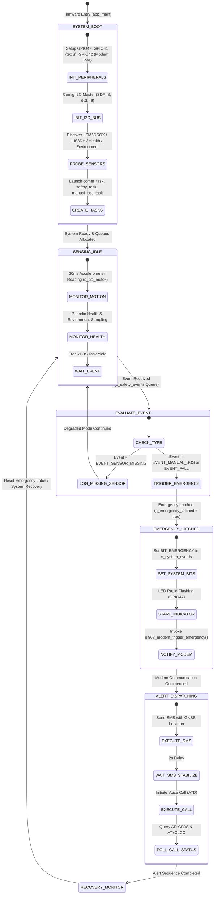
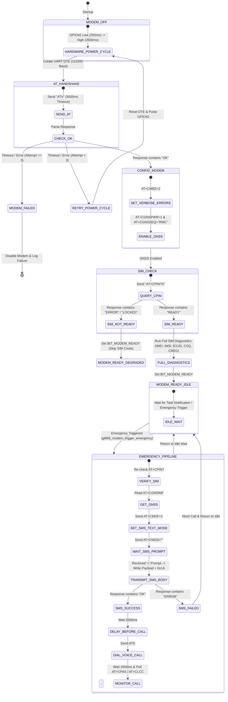

# ESP32-S3 Mini-1 & SIM868 Smart Safety Band Architecture, AT Command Analysis, and State Machines

## Executive Summary
This document provides an in-depth technical analysis and system architecture breakdown of the **Smart Safety Band** firmware running on the **ESP32-S3 Mini-1** module integrated with the **SIM868 (GSM/GPRS + GNSS)** cellular modem. It details the FreeRTOS multi-tasking architecture, hardware-software peripheral mapping, emergency safety event processing pipelines, AT command communication handling, error mitigation strategies, and state machine implementations.

---

# 1. System Hardware & Component Architecture

### Hardware Pin Mapping (ESP32-S3 Mini-1 & SIM868)
| Peripheral / Function | ESP32-S3 GPIO | Configuration / Interface | Notes |
|---|---|---|---|
| **I2C SDA** | `GPIO8` | Master I2C (400 kHz) | Shared sensor bus (LSM6DSOX, legacy LIS3DH, environmental/health sensors) |
| **I2C SCL** | `GPIO9` | Master I2C (400 kHz) | Shared sensor bus |
| **Status LED** | `GPIO47` | Push-Pull Output | System status indicator & emergency rapid flasher |
| **SIM868 UART TX** | `GPIO17` | UART1 TX (115200 baud) | Connected to SIM868 RXD |
| **SIM868 UART RX** | `GPIO18` | UART1 RX (115200 baud) | Connected to SIM868 TXD |
| **SIM868 Power Control** | `GPIO42` | Push-Pull Output | Hardware power cycle control line |
| **SOS Push Button** | `GPIO41` | Input w/ Pull-Up (`GPIO_INTR_NEGEDGE`) | Active-Low emergency button interrupt source |
| **Motion Interrupt** | `GPIO2` | Input | Motion sensor interrupt line |
| **Battery ADC** | `ADC1_CH0` (`GPIO1`) | Analog Input | Battery voltage monitoring |

---

# 2. ESP32-S3 Firmware Architecture & Task Model

The firmware utilizes a layered, concurrent, event-driven FreeRTOS architecture designed on top of ESP-IDF.

```
+-----------------------------------------------------------------------------------+
|                               APPLICATION LAYER                                  |
|  +-----------------------+     +-----------------------+     +-----------------+  |
|  |  manual_sos_task      |     |  safety_manager_task  |     |comm_task (Modem)|  |
|  |  (Priority 8, 4KB)    |     |  (Priority 9, 4KB)    |     |(Priority 10,4KB)|  |
|  +-----------+-----------+     +-----------^-----------+     +--------+--------+  |
+--------------|-----------------------------|--------------------------|-----------+
|              |                             |                          |           |
|      [xSemaphoreGive]              [xQueueReceive]             [Direct Notify]    |
|              v                             |                          v           |
+--------------+-----------------------------+--------------------------+-----------+
|                                SERVICE & QUEUE LAYER                              |
|  +--------------------+   +---------------------------+   +--------------------+  |
|  |   s_sos_sem        |   |   s_safety_events Queue   |   | s_system_events    |  |
|  | (Binary Semaphore) |   |    (Depth 16, Event Struct)   |   |   (Event Group)    |  |
|  +--------------------+   +---------------------------+   +--------------------+  |
+-----------------------------------------------------------------------------------+
|                                DRIVER & HW HAL LAYER                              |
|  +--------------------+   +---------------------------+   +--------------------+  |
|  | GPIO Driver & ISR  |   | Shared I2C (s_i2c_mutex)  |   | UART DTE (SIM868)  |  |
|  +--------------------+   +---------------------------+   +--------------------+  |
+-----------------------------------------------------------------------------------+
```

### Active & Target Task Distribution
1. **`communication_task` (Priority 10, Stack 4KB)**:
   - Highest application priority to guarantee instant access to the SIM868 modem.
   - Manages power-cycling, UART DTE initialization, AT command execution, diagnostic routines, SMS dispatch, and voice call placement.
2. **`safety_manager_task` (Priority 9, Stack 4KB)**:
   - High priority safety event processor. Consumes `safety_event_t` from `s_safety_events` queue.
   - Latches the emergency state (`s_emergency_latched`), sets `BIT_EMERGENCY` in `s_system_events`, notifies `communication_task`, and invokes modem emergency routines.
3. **`manual_sos_task` (Priority 8, Stack 4KB)**:
   - Blocked on `s_sos_sem`. When the user presses the SOS button (`GPIO41` interrupt), `sos_isr()` yields the binary semaphore.
   - Publishes `EVENT_MANUAL_SOS` into `s_safety_events`.
4. **Motion / Sensor Task (Target / Extensible)**:
   - 20 ms period task reading LSM6DSOX/LIS3DH accelerometer data under `s_i2c_mutex` protection.
   - Detects fall impact vectors and posts `EVENT_FALL` to `s_safety_events`.

---

# 3. Emergency Alert Use Cases & Execution Workflows

### Use Case 1: Manual SOS Trigger
1. **User Action**: User depresses active-low SOS button on `GPIO41`.
2. **ISR Level**: `sos_isr()` triggers on negative edge, executes `xSemaphoreGiveFromISR(s_sos_sem)`, performing `portYIELD_FROM_ISR()`.
3. **Task Level**: `manual_sos_task` unblocks from `s_sos_sem` and calls `publish_event(EVENT_MANUAL_SOS, 0, "SOS button")`.
4. **Safety Pipeline**: `safety_manager_task` dequeues `EVENT_MANUAL_SOS`.
   - Checks `!s_emergency_latched`.
   - Sets `s_emergency_latched = true`.
   - Sets `BIT_EMERGENCY` bit in `s_system_events`.
   - Calls `gl868_modem_trigger_emergency("SOS button", 0)`.

### Use Case 2: Fall Detection Alert
1. **Sensor Level**: Accelerometer reports magnitude delta exceeding `FALL_DELTA_MG` (1800 mg threshold).
2. **Queue Push**: Motion monitor calls `publish_event(EVENT_FALL, delta_mg, "LSM6DSOX")`.
3. **Safety Dispatch**: `safety_manager_task` latches emergency and triggers SIM868 notification sequence.

### Emergency Alert Notification Sequence (`gl868_modem_trigger_emergency`)
```
[Emergency Event]
       |
       v
+-------------------------------+
| Check SIM Readiness           | ---> (AT+CPIN?) ---> If NOT READY: Log warning & Abort
+---------------+---------------+
                | READY
                v
+-------------------------------+
| Acquire GNSS Location        | ---> (AT+CGNSINF) ---> Retrieve Latitude/Longitude string
+---------------+---------------+
                |
                v
+-------------------------------+
| Formulate Payload Message     | ---> "SOS triggered by [source] ([val]). GPS: [lat,lon,...]"
+---------------+---------------+
                |
                v
+-------------------------------+
| Send SMS Alert                | ---> (AT+CMGF=1 -> AT+CMGS="..." -> Prompt '>' -> Payload + 0x1A)
+---------------+---------------+
                |
                | SMS OK
                v
+-------------------------------+
| Stabilization Delay (2000 ms) | ---> Allow SMS network transmission to complete
+---------------+---------------+
                |
                v
+-------------------------------+
| Initiate Emergency Voice Call | ---> (ATD+916309538622;)
+---------------+---------------+
                |
                v
+-------------------------------+
| Poll Call & Activity Status   | ---> (AT+CPAS & AT+CLCC?) ---> Log current call status
+-------------------------------+
```

---

# 4. In-Depth AT Command Suite Analysis & Issue Investigation

The SIM868 modem is controlled via UART AT commands using the ESP-IDF `esp_modem` component (`DTE` pattern). Below is the comprehensive analysis of all AT commands used in the codebase, their purpose, responses, and potential issues.

### Complete AT Command Breakdown
| AT Command | Category | Purpose | Success Marker / Response | Timeout |
|---|---|---|---|---|
| `AT\r` | Handshake | Verify modem UART baud rate & responsiveness | `OK` | 3000 ms |
| `ATI\r` | Identification | Retrieve modem model details (SIM868) | `SIM868 ... OK` | 4000 ms |
| `AT+CMEE=2\r` | Error Config | Enable verbose numeric & text error codes | `OK` | 3000 ms |
| `AT+CPIN?\r` | SIM Status | Query SIM PIN/READY status | `+CPIN: READY` | 5000 ms |
| `AT+CCID?\r` | SIM Info | Read SIM card ICCID number | `+CCID: <iccid>` | 6000 ms |
| `AT+CSQ\r` | Network | Query Received Signal Strength Indicator (RSSI) | `+CSQ: <rssi>,<ber>` | 6000 ms |
| `AT+COPS?\r` | Network | Query current cellular network operator | `+COPS: <mode>,<format>,"<oper>"` | 4000 ms |
| `AT+CREG?\r` | Network | Check GSM network registration status | `+CREG: <n>,<stat>` | 4000 ms |
| `AT+CGREG?\r` | Network | Check GPRS network registration status | `+CGREG: <n>,<stat>` | 4000 ms |
| `AT+CGSN\r` | SIM Info | Read modem IMEI number | `<imei> OK` | 4000 ms |
| `AT+CIMI\r` | SIM Info | Read SIM IMSI identifier | `<imsi> OK` | 4000 ms |
| `AT+CNUM\r` | SIM Info | Read subscriber phone number | `+CNUM: ...` | 4000 ms |
| `AT+CSCA?\r` | SMS Config | Read SMS Service Center Address | `+CSCA: "<number>",<type>` | 4000 ms |
| `AT+CMGF=1\r` | SMS Config | Set SMS messaging to Text Mode | `OK` | 5000 ms |
| `AT+CMGS="<num>"\r` | SMS Send | Initiate SMS send to destination number | Prompt `>` | 10000 ms |
| `<msg>\x1A` | SMS Payload | Submit SMS text body + CTRL+Z (`0x1A`) terminator | `+CMGS: <mr> OK` | 15000 ms |
| `ATD<num>;\r` | Voice Call | Initiate voice call (trailing `;` denotes voice) | `OK` / `VOICE CALL` | 6000 ms |
| `AT+CPAS\r` | Call Status | Query phone activity status (0=ready, 3=ring, 4=call) | `+CPAS: <pas>` | 4000 ms |
| `AT+CLCC?\r` | Call Status | List current active call connections | `+CLCC: <id>,<dir>,<stat>,...` | 5000 ms |
| `AT+CGNSPWR=1\r` | GNSS / GPS | Turn ON internal SIM868 GNSS power | `OK` | 3000 ms |
| `AT+CGNSSEQ="RMC"\r` | GNSS / GPS | Set NMEA sentence sequence to RMC | `OK` | 3000 ms |
| `AT+CGNSINF\r` | GNSS / GPS | Read GNSS fix, lat/lon, altitude, speed, UTC | `+CGNSINF: 1,1,<UTC>,<lat>,<lon>,...` | 5000 ms |
| `AT+CBC\r` | Power / Battery | Query battery charge state & voltage | `+CBC: <bcs>,<bcl>,<voltage>` | 4000 ms |
| `AT+CIPGSMLOC=1,1\r`| Location | Retrieve GSM cell tower location & time | `+CIPGSMLOC: 0,<lon>,<lat>,<date>` | 10000 ms |

---

### Critical AT Command Issues & Firmware Resolutions

#### Issue 1: Modem Unresponsive or Frozen Post-Reset
- **Symptom**: Modem does not return `OK` to `AT\r` command on startup; stays silent or emits garbage bytes.
- **Root Cause**: The SIM868 internal UART state machine can hang if power wasn't toggled cleanly or if previous serial transmissions were truncated mid-command.
- **Code Resolution (`gl868_modem.cpp`)**:
  - Implements a hardware power cycle using `GPIO42`:
    ```cpp
    gpio_set_level(GPIO_NUM_42, 0); // Pull power key low
    vTaskDelay(pdMS_TO_TICKS(250));
    gpio_set_level(GPIO_NUM_42, 1); // Release power key high
    vTaskDelay(pdMS_TO_TICKS(2500)); // Allow modem boot delay
    ```
  - Up to 3 initialization retries with automated DTE destruction, GPIO power cycling, and DTE re-creation.

#### Issue 2: Spurious CME Errors & `SIM Busy` / `Operation Not Allowed`
- **Symptom**: Executing `AT+CIMI`, `AT+CCID`, or `AT+CMGS` returns `+CME ERROR: operation not allowed` or `SIM PIN required`.
- **Root Cause**: Querying SIM card registers before the cellular network or SIM controller has finished initialization.
- **Code Resolution**:
  - Gating all SIM-dependent commands behind `is_sim_ready()`:
    ```cpp
    static bool is_sim_ready(std::string *out_status) {
        std::string response;
        if (!send_at_command("AT+CPIN?\r", &response, 5000)) return false;
        return trim_response(response).find("READY") != std::string::npos;
    }
    ```
  - In `gl868_modem_run_full_diagnostics()`, SIM-dependent AT checks (`CIMI`, `CCID`, `CNUM`, `CGATT`) are completely skipped if `is_sim_ready()` returns `false`.

#### Issue 3: Two-Stage SMS Prompt Timeout & Loss
- **Symptom**: Standard single-step AT command execution fails when sending SMS because `AT+CMGS` expects a prompt character `>` rather than `OK`.
- **Root Cause**: The standard `esp_modem` response parser waits for `OK` or `ERROR\r\n`. It times out when receiving `> `.
- **Code Resolution**:
  - Implements a two-phase command function `wait_for_prompt()` using custom separator `>`:
    ```cpp
    // Phase 1: Send AT+CMGS="..." and wait specifically for '>' prompt
    if (!wait_for_prompt("AT+CMGS=\"" + number + "\"\r", ">", &response, 10000, '>')) {
        return false;
    }
    // Phase 2: Send text payload terminated with CTRL+Z (0x1A) and wait for 'OK'
    const std::string payload = message + std::string(1, '\x1A');
    s_state.dte->command(payload, ... 15000ms);
    ```

#### Issue 4: Call Verification & Non-Blocking State Handling
- **Symptom**: `ATD<number>;` command returns `OK` instantly upon dialing, but gives no insight into whether the remote phone rang, answered, or failed due to network congestion.
- **Root Cause**: `ATD` returns `OK` when the command request is accepted by the modem's call engine, not when the call is answered.
- **Code Resolution**:
  - Immediately following `make_call()`, the firmware waits 2000 ms and then issues `log_call_activity_status()`:
  - Queries `AT+CPAS\r` (Phone Activity Status):
    - `0`: Ready (idle)
    - `3`: Ringing
    - `4`: Call in progress (Active call)
  - Queries `AT+CLCC?\r` (Current Call List) to list active speech channels.

---

# 5. State Machine Diagram Implementation

### 1. System Safety State Machine
This state machine governs the overall operation of the Smart Safety Band on the ESP32-S3, managing transitions from initial power-on through sensing, emergency latching, notification dispatch, and recovery.



---

### 2. SIM868 Modem & Communication Engine State Machine
This state machine controls the UART modem DTE bridge, handling power management, handshakes, SIM verification, GNSS setup, SMS/Voice execution, and error retries.



---

# Summary & Key Recommendations

1. **Hardware Power Key Integration**: GPIO42 power cycling provides reliable hardware-level recovery when the modem becomes unresponsive to serial AT commands.
2. **SIM Readiness Guarding**: Checking `AT+CPIN?` before firing SIM-dependent commands prevents cluttering the logs with spurious CME errors during modem registration.
3. **Dedicated Emergency Task Prioritization**: Running `communication_task` at Priority 10 and `safety_manager_task` at Priority 9 ensures zero preemption delay during life-safety alerts.
4. **Non-Blocking Execution**: All UART interactions use `esp_modem::DTE` asynchronous callbacks with explicit timeouts, preventing kernel stalls or task starvation.
